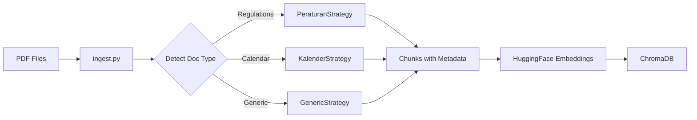
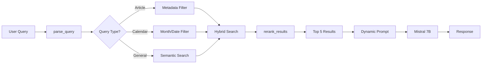

# 🎓 Prototype Chatbot LLM Akademik ITB

Sistem chat assistant berbasis RAG (Retrieval-Augmented Generation) untuk menjawab pertanyaan seputar **Peraturan Akademik** dan **Kalender Akademik ITB** menggunakan **Mistral 7B** local model.


---

## 📋 Table of Contents

- [Features](#-features)
- [Tech Stack](#-tech-stack)
- [Project Structure](#-project-structure)
- [Setup & Installation](#-setup--installation)
- [Usage](#-usage)
- [Architecture](#-architecture)
- [Key Concepts](#-key-concepts)
- [API Documentation](#-api-documentation)
- [Contributing](#-contributing)

---

## ✨ Features

### 🤖 Smart RAG System
- **Multi-Document Support** - Handle berbagai jenis dokumen akademik
- **Hybrid Search** - Kombinasi semantic similarity + metadata filtering
- **Context-Aware Chunking** - Strategy pattern untuk chunking optimal per doc type
- **Table Extraction** - Extract tabel dari PDF kalender menggunakan pdfplumber
- **Dynamic Prompting** - Prompt engineering yang adaptif sesuai query type

### 📚 Document Processing
- **Peraturan Akademik** - Article-aware chunking (split by "Pasal X")
- **Kalender Akademik** - Table extraction + month-based chunking
- **Generic Documents** - Fallback strategy dengan RecursiveCharacterTextSplitter

### 🎨 Modern UI
- **Next.js 16** - App Router dengan TypeScript
- **Responsive Design** - Mobile-friendly dengan Tailwind CSS
- **Real-time Chat** - Instant response dengan loading states
- **Source Citations** - Tampilkan sumber dokumen sebagai referensi

### 🔒 Privacy & Performance
- **100% Local** - Semua inference di local machine (no cloud API)
- **Fast** - Mistral 7B optimized untuk speed
- **Secure** - Data tidak keluar dari server Anda

---

## 🛠️ Tech Stack

### Backend
| Technology | Purpose | Version |
|------------|---------|---------|
| **FastAPI** | REST API Server | 0.100+ |
| **Ollama** | Local LLM Runtime | Latest |
| **Mistral 7B** | Language Model | Custom (mistral-itb) |
| **ChromaDB** | Vector Database | Latest |
| **HuggingFace** | Embeddings | all-MiniLM-L6-v2 |
| **pdfplumber** | Table Extraction | Latest |
| **LangChain** | LLM Framework | Latest |

### Frontend
| Technology | Purpose | Version |
|------------|---------|---------|
| **Next.js** | React Framework | 16 |
| **TypeScript** | Type Safety | 5+ |
| **Tailwind CSS** | Styling | 4 |
| **React** | UI Library | 19 |

---

## 📁 Project Structure

```
Prototype/
├── backend/                      # FastAPI Backend
│   ├── main.py                   # 🌟 API Server (entry point)
│   ├── ingest.py                 # 🌟 Document ingestion
│   ├── utils.py                  # 🌟 Helper functions
│   ├── document_strategies.py    # 🌟 Chunking strategies
│   ├── table_extractor.py        # 🌟 Table extraction
│   ├── .gitignore                # Git ignore rules
│   └── requirements.txt          # Python dependencies
│
├── frontend/                     # Next.js Frontend
│   ├── app/                      # Next.js App Router
│   │   ├── page.tsx              # Main page
│   │   ├── layout.tsx            # Root layout
│   │   └── globals.css           # Global styles
│   ├── components/               # React components
│   │   ├── ChatInterface.tsx     # Main chat component
│   │   ├── ChatMessage.tsx       # Message bubbles
│   │   └── LoadingDots.tsx       # Loading indicator
│   ├── lib/                      # Utilities
│   │   └── api.ts                # API service
│   ├── types/                    # TypeScript types
│   │   └── chat.ts               # Type definitions
│   ├── package.json              # NPM dependencies
│   └── .env.local                # Environment variables
│
├── documents/                    # 📄 PDF files (not in repo)
├── chroma_db/                    # 💾 Vector DB (not in repo)
├── venv/                         # 🐍 Python virtual env (not in repo)
├── .gitignore                    # Root gitignore
└── README.md                     # This file
```

### 🌟 Core Files Explanation

| File | Purpose | Key Functions |
|------|---------|---------------|
| `main.py` | FastAPI server dengan hybrid search logic | `/chat` endpoint, query parsing, re-ranking |
| `ingest.py` | Load PDFs → Chunk → Embed → Save to DB | Auto doc-type detection, table extraction |
| `utils.py` | Helper functions | `parse_query()`, `rerank_results()` |
| `document_strategies.py` | Strategy pattern untuk chunking | `PeraturanStrategy`, `KalenderStrategy` |
| `table_extractor.py` | Extract tabel dari PDF kalender | `CalendarTableExtractor` class |

---

## 🚀 Setup & Installation

### Prerequisites

Pastikan Anda sudah install:
- ✅ **Python 3.12+**
- ✅ **Node.js 18+**
- ✅ **Ollama** - [Download](https://ollama.ai)
- ✅ **Git**

### 1. Clone Repository

```bash
git clone https://github.com/sibobbbbbb/prototype-chatbot-llm-akademik.git
cd prototype-chatbot-llm-akademik
```

### 2. Setup Ollama Model

Pastikan model `mistral-itb` sudah ter-install:

```bash
# Check available models
ollama list

# Jika belum ada, create dari Modelfile
# (Sesuaikan dengan setup Anda)
ollama create mistral-itb -f Modelfile
```

### 3. Backend Setup

```bash
cd backend

# Create virtual environment
python -m venv ../venv

# Activate (Windows)
..\venv\Scripts\activate

# Activate (Linux/Mac)
source ../venv/bin/activate

# Install dependencies
pip install -r requirements.txt
```

### 4. Prepare Documents

```bash
# Place your PDF files in documents folder
mkdir ../documents  # if not exists
# Copy your PDF files here
```

### 5. Ingest Documents

```bash
# Run ingestion (this will take time)
python ingest.py

# Output:
# ✂️ Total XXX chunks from all documents
# 🎉 Database Ready!
```

### 6. Start Backend Server

```bash
python main.py

# Server will run at http://localhost:8000
```

### 7. Frontend Setup

Open **new terminal**:

```bash
cd frontend

# Install dependencies
npm install

# Create .env.local (if not exists)
echo "NEXT_PUBLIC_API_URL=http://localhost:8000" > .env.local

# Start development server
npm run dev

# Frontend will run at http://localhost:3000
```

### 8. Access Application

Open browser: **http://localhost:3000** 🎉

---

## 💻 Usage

### Running the Application

**Terminal 1 - Backend:**
```bash
cd backend
..\venv\Scripts\activate  # Windows
python main.py
```

**Terminal 2 - Frontend:**
```bash
cd frontend
npm run dev
```

### Example Queries

#### Peraturan Akademik
```
❓ "Sebutkan pasal 13 peraturan akademik ITB"
❓ "Apa isi pasal 25 tentang cuti akademik?"
❓ "Bandingkan pasal 10 dan pasal 15"
```

#### Kalender Akademik
```
❓ "Kapan jadwal ujian semester Januari 2025?"
❓ "Apa saja kegiatan di bulan Februari?"
❓ "Tanggal berapa libur semester?"
```

#### General
```
❓ "Apa syarat kelulusan program sarjana?"
❓ "Bagaimana prosedur pengajuan cuti?"
```

---

## 🏗️ Architecture

### Data Flow

#### 1. Ingestion Pipeline


#### 2. Query Pipeline


### Component Interaction

```
┌─────────────────┐      HTTP      ┌──────────────────┐
│   Next.js UI    │ ◄─────────────► │   FastAPI API    │
│  (Port 3000)    │                 │   (Port 8000)    │
└─────────────────┘                 └──────────────────┘
                                            │
                                            ▼
                                    ┌──────────────────┐
                                    │   ChromaDB       │
                                    │  (Vector Store)  │
                                    └──────────────────┘
                                            │
                                            ▼
                                    ┌──────────────────┐
                                    │  Ollama API      │
                                    │  (Mistral 7B)    │
                                    │  (Port 11434)    │
                                    └──────────────────┘
```

---

## 🔑 Key Concepts

### 1. Strategy Pattern for Chunking

Different document types need different chunking strategies:

**Peraturan (Regulations):**
```python
# Split by article boundaries
Pasal 1: [content]
Pasal 2: [content]
# → Each article = separate chunk with metadata
```

**Kalender (Calendar):**
```python
# Extract tables with pdfplumber
| Tanggal | Kegiatan |
|---------|----------|
| 12 Jan  | Ujian    |
# → Each row = chunk with month/date metadata
```

### 2. Hybrid Search

Combines multiple search strategies:

```python
if query has article_number:
    # Metadata filter
    results = db.search(filter={"article_number": 13})
elif query has month:
    # Month filter
    results = db.search(filter={"month": "Januari"})
else:
    # Semantic search
    results = db.similarity_search(query)
```

### 3. Dynamic Prompting

Prompts adapt based on query type:

```python
if query_type == "specific_article":
    prompt = "Quote the full article content..."
elif query_type == "calendar":
    prompt = "List dates and events..."
else:
    prompt = "Answer based on context..."
```

---

## 📡 API Documentation

### Endpoint: `POST /chat`

**Request:**
```json
{
  "question": "Sebutkan pasal 13 peraturan akademik ITB"
}
```

**Response:**
```json
{
  "answer": "Pasal 13: [full article content]...",
  "sources": [
    "Buku_Peraturan_Akademik_2024_PR_25A.pdf (Page 12)",
    "Buku_Peraturan_Akademik_2024_PR_25A.pdf (Page 13)"
  ]
}
```

**Error Response:**
```json
{
  "detail": "Error message"
}
```

---

## 🧪 Development

### Adding New Document Strategies

1. Create new strategy class in `document_strategies.py`:
```python
class MyCustomStrategy(DocumentStrategy):
    @staticmethod
    def detect(filename: str, content: str) -> bool:
        # Your detection logic
        return "custom" in filename.lower()
    
    @staticmethod
    def chunk(text: str, metadata: dict, max_chunk_size: int = 2000):
        # Your chunking logic
        return chunks
```

2. Add to factory:
```python
STRATEGIES = [
    PeraturanStrategy,
    KalenderStrategy,
    MyCustomStrategy,  # Add here
    GenericStrategy    # Keep as fallback
]
```

### Running Tests

```bash
# Backend tests
cd backend
python -m pytest  # if you add tests

# Frontend build test
cd frontend
npm run build
```

---

## 📊 Performance

Tested on:
- **CPU**: Intel i5 / AMD Ryzen 5
- **RAM**: 16GB
- **Storage**: SSD

Performance:
- **Ingestion**: ~50 pages/minute
- **Query Response**: 2-5 seconds
- **Embedding**: ~100ms per chunk

---

## 🐛 Troubleshooting

### Backend won't start
```bash
# Check if port 8000 is available
netstat -ano | findstr :8000

# Check ChromaDB
ls ../chroma_db  # should have data
```

### Ollama connection error
```bash
# Check Ollama is running
ollama list

# Check model exists
ollama run mistral-itb "test"
```

### Frontend build errors
```bash
# Clear cache and reinstall
rm -rf node_modules .next
npm install
npm run dev
```

---

## 📝 To-Do / Future Enhancements

- [ ] Add chat history with localStorage
- [ ] Export conversation to PDF
- [ ] Multi-language support (English/Indonesian toggle)
- [ ] Voice input/output
- [ ] Document upload via UI
- [ ] Admin panel for document management
- [ ] Docker deployment
- [ ] Unit tests & integration tests

---

## 👥 Contributing

Contributions are welcome! Please:

1. Fork the repository
2. Create feature branch (`git checkout -b feature/AmazingFeature`)
3. Commit changes (`git commit -m 'Add some AmazingFeature'`)
4. Push to branch (`git push origin feature/AmazingFeature`)
5. Open a Pull Request

---

## 📄 License

This project is part of ITB Final Project (Tugas Akhir).

---

## 🙏 Acknowledgments

- **Institut Teknologi Bandung** - Academic institution
- **Ollama** - Local LLM runtime
- **Mistral AI** - Base model
- **LangChain** - RAG framework
- **ChromaDB** - Vector database

---

## 📧 Contact

For questions or support, please contact:
- **GitHub**: [@sibobbbbbb](https://github.com/sibobbbbbb)
- **Repository**: [prototype-chatbot-llm-akademik](https://github.com/sibobbbbbb/prototype-chatbot-llm-akademik)

---

**Made with ❤️ for ITB Academic Community**
